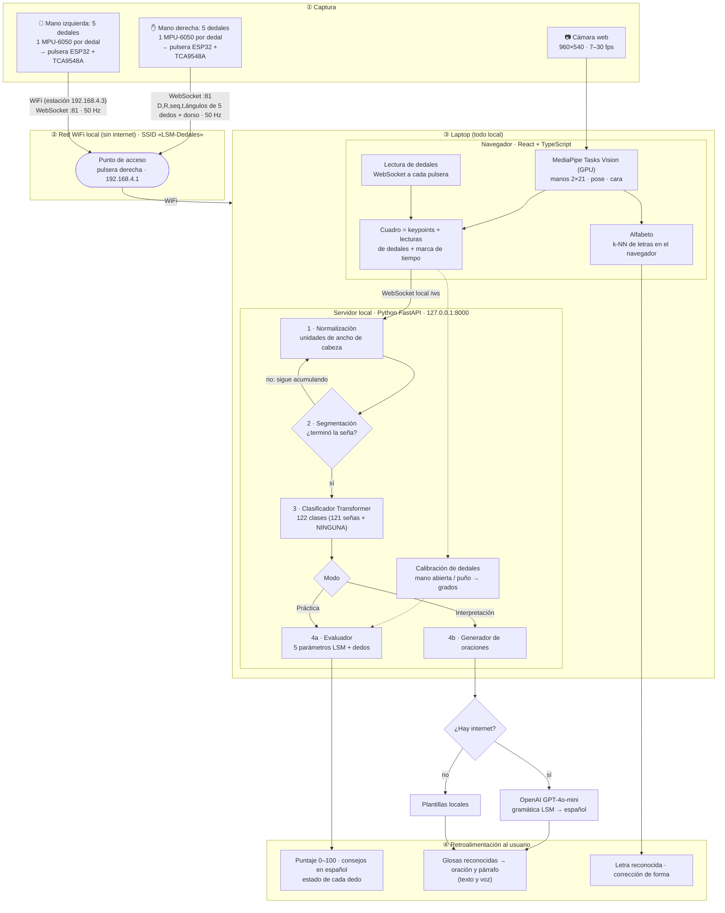
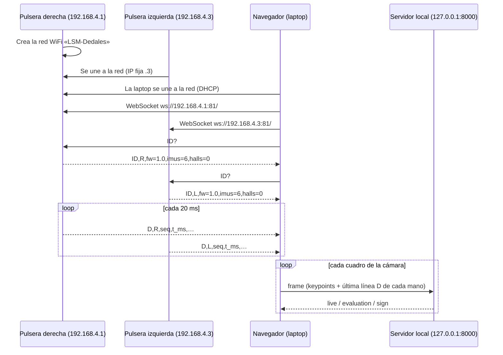

# Arquitectura del sistema — Intérprete y evaluador de LSM

INDIVISA INGENIUM 2026 · Universidad La Salle Oaxaca

Sistema que **evalúa y traduce Lengua de Señas Mexicana (LSM)** en tiempo real combinando **visión por computadora**,
**dedales instrumentados inalámbricos** (uno por dedo) e **inteligencia artificial**. Da retroalimentación correctiva de cada seña
(Práctica), convierte secuencias de señas en oraciones en español (Interpretación) y enseña el alfabeto manual
(Alfabeto).

> **Principio de diseño.** El video nunca sale de la laptop: el navegador extrae **puntos clave** (keypoints) y solo
> esas coordenadas se procesan. Todo funciona **sin internet**; la única función que lo aprovecha es la redacción
> natural de oraciones, con respaldo local.

---

## 1. Diagrama de flujo



La misma figura como imagen para diapositivas: [`arquitectura-flujo.svg`](arquitectura-flujo.svg) (vectorial) y [`arquitectura-flujo.png`](arquitectura-flujo.png).

---

## 2. Topología de red (WiFi sin internet)

Los dedales **no dependen de la red del evento**: el ESP32 de la pulsera derecha crea su propia red.

| Elemento | Rol | Dirección |
|---|---|---|
| ESP32 de la pulsera **derecha** | **Punto de acceso** (SoftAP, WPA2) · SSID `LSM-Dedales` · servidor WebSocket en el puerto 81 | `192.168.4.1` |
| ESP32 de la pulsera **izquierda** | Estación conectada a `LSM-Dedales` · servidor WebSocket en el puerto 81 | `192.168.4.3` (fija) |
| Laptop | Se conecta a `LSM-Dedales` por WiFi | `192.168.4.x` (DHCP) |
| Navegador ↔ servidor | Comunicación **interna** de la laptop | `127.0.0.1:8000` |

**Internet durante la demo.** Al unirse a `LSM-Dedales` la laptop no tiene salida a internet por WiFi. Opciones:

1. **Sin internet** (válido): todo funciona; las oraciones se redactan con **plantillas locales** (más simples).
2. **Internet por otra vía**: celular por **USB (anclaje de red)** o **cable Ethernet**. Windows usa esa conexión para
   internet y el WiFi solo para los dedales (si hiciera falta, dar menor prioridad —métrica— a la interfaz WiFi).

**Alternativa por cable:** las mismas pulseras pueden conectarse por **USB (Web Serial)** con el mismo protocolo; es
el modo más robusto y sirve de plan B si hay interferencia WiFi en el evento.

---

## 3. Protocolo de comunicación pulsera ↔ laptop

### 3.1 Pila de protocolos

| Capa | Protocolo | Detalle |
|---|---|---|
| Física / enlace | **WiFi IEEE 802.11 b/g/n, 2.4 GHz** | La pulsera derecha es punto de acceso (**SoftAP, WPA2-PSK**), SSID `LSM-Dedales`, canal fijo |
| Red | **IPv4** | Subred `192.168.4.0/24`; el ESP32 asigna la IP de la laptop por DHCP |
| Transporte | **TCP** | Entrega ordenada y sin pérdidas dentro de la conexión |
| Aplicación | **WebSocket (RFC 6455)** · puerto **81** · ruta `/` | Mensajes de **texto**: 1 mensaje = 1 línea del protocolo |
| Respaldo por cable | **USB serie** (CDC) · 921 600 baudios · 8N1 | Mismas líneas, terminadas en `\n` (Web Serial en el navegador) |

**¿Por qué WebSocket?** El navegador no puede abrir sockets TCP o UDP directos; WebSocket es el mecanismo estándar para
recibir datos en tiempo real de otro dispositivo, es bidireccional, tiene baja latencia y el ESP32 lo soporta con
bibliotecas ligeras. Como el contenido es **el mismo texto que por USB**, el servidor no cambia: solo cambia el
transporte en el navegador.

### 3.2 Mensajes

**Laptop → pulsera**

| Mensaje | Significado |
|---|---|
| `ID?` | Solicita la identificación de la pulsera. Se reenvía cada 500 ms hasta recibir respuesta (máximo 5 s). |

**Pulsera → laptop**

```
ID,<L|R>,fw=<versión>,imus=6,halls=0
D,<L|R>,<seq>,<t_ms>,p0,r0,p1,r1,p2,r2,p3,r3,p4,r4,p5,r5,gx,gy,gz,<status>
```

| Campo | Tipo | Descripción |
|---|---|---|
| `D` | texto | Tipo de mensaje: lectura de datos |
| `L` / `R` | texto | Mano: izquierda o derecha (derecha = mano 0 de la visión) |
| `seq` | entero | Contador que aumenta en cada lectura: detecta pérdidas y lecturas congeladas |
| `t_ms` | entero | Milisegundos desde que encendió el ESP32 |
| `p0, r0` | grados, 1 decimal | Inclinación (*pitch*) y giro (*roll*) de la **IMU 0 = dorso de la mano** (pulsera) |
| `p1…p5, r1…r5` | grados, 1 decimal | Inclinación y giro de los **dedales**: 1 pulgar, 2 índice, 3 medio, 4 anular, 5 meñique |
| `gx, gy, gz` | °/s, 1 decimal | Velocidad angular del dorso (giroscopio de la IMU 0) |
| `status` | entero (bits) | Bit *i* = 1 si la IMU *i* responde (`63` = las 6 funcionan) |

Ejemplo (mano derecha, lectura 1532):

```
D,R,1532,30640,12.5,-3.1,48.2,5.0,61.7,2.3,58.9,1.1,55.4,-0.4,50.2,-2.0,0.4,-1.2,0.8,63
```

- **Frecuencia:** 50 lecturas por segundo por pulsera (cada 20 ms), unos 110 bytes por lectura (~5.5 KB/s por mano).
- **Cálculo en el servidor:** flexión de cada dedo = `p_dedo − p0` (normalizada a −180…180°); la calibración con mano
  abierta y puño la convierte a la misma escala de ángulos que mide la cámara.

### 3.3 Secuencia de conexión



### 3.4 Robustez

- **Lectura congelada:** si el `seq` de una mano no cambia durante más de 10 cuadros, el servidor la trata como
  ausente y usa solo la cámara para esa mano.
- **Desconexión:** el navegador reintenta la conexión WebSocket automáticamente; mientras tanto la app sigue
  funcionando con la cámara.
- **Sensor dañado:** los bits de `status` marcan qué IMU no responde; ese dedo se evalúa solo con la cámara.
- **Sin WiFi:** las mismas pulseras se conectan por USB con idéntico formato.

---

## 4. Capas del sistema

### ① Captura
- **Cámara web**: 960×540; el sistema se adapta a la tasa real de cuadros (probado de 7 a 30 fps).
- **Dedales (×10, 5 por mano)**: cada dedal lleva una **IMU MPU-6050** sobre la falange distal y mide la
  orientación (inclinación y giro) de ese dedo. Van por cable delgado (I²C) a una **pulsera** en cada muñeca.
- **Pulseras (×2)**: cada una lleva un **ESP32**, un multiplexor I²C **TCA9548A** (la MPU-6050 solo admite dos
  direcciones, así que el mux da un canal a cada dedal), la batería y una **sexta MPU-6050 sobre el dorso de la mano
  (necesaria)**: la flexión de cada dedo se calcula como *ángulo del dedal − ángulo del dorso*, así no cambia al
  girar la muñeca (12 MPU-6050 en total: 10 dedales + 2 pulseras). Frecuencia de envío: ~50 Hz.
- Ventaja frente a un guante completo: la palma y los dedos quedan libres, la cámara ve la mano sin obstrucción
  (MediaPipe detecta mejor) y se adapta a distintos tamaños de mano. Los **contactos entre dedos** los mide la
  cámara (distancias entre puntas en MediaPipe), ya que los dedales no llevan sensor de contacto.

### ② Comunicación
| Tramo | Medio | Formato |
|---|---|---|
| Pulseras → navegador | WiFi local, WebSocket (puerto 81) — o USB como respaldo | Texto por líneas (ver sección 3) |
| Navegador → servidor | WebSocket local `/ws` | JSON por cuadro: keypoints (1 decimal) + última lectura de cada pulsera + marca de tiempo |
| Servidor → navegador | WebSocket local `/ws` | JSON: `evaluation`, `sign`, `sentence`, `live` (dedos en vivo), avisos |
| Servidor → OpenAI | HTTPS (solo si hay internet) | Glosas + contexto → oración |

Controles: identificación de cada pulsera (`ID?`), detección de lecturas congeladas (sin número de secuencia nuevo),
reconexión automática y descarte de cuadros si la red se satura.

### ③ Procesamiento (laptop)

**Navegador (React 18 + TypeScript + Vite):**
- **MediaPipe Tasks Vision 0.10.14** en GPU: manos (2×21 puntos 3D) cada cuadro, pose corporal cada 2 y malla facial
  (22 puntos de referencia) cada 3.
- **Alfabeto**: clasificador **k-NN** de 27 letras que corre en el navegador, con las poses del cartel oficial SEP y
  detección de movimiento para J, K, Ñ, Q, X, Z.
- Interfaz accesible (contraste AA, objetivos ≥ 44 px, lector de pantalla) con diseño «Liquid Glass».

**Servidor (Python 3.12 + FastAPI + PyTorch en CPU)**, una sesión por conexión:
1. **Normalización** — coordenadas en **unidades de ancho de cabeza** (ancla: nariz y mejillas; respaldo: orejas):
   independiente de la distancia a la cámara y la resolución. Mano 0 = derecha de la persona = pulsera derecha.
2. **Segmentación** — detecta inicio y fin de cada seña (reposo, quietud o duración máxima); umbrales en segundos,
   ajustados a los fps reales.
3. **Clasificador** — **Transformer** (128 dimensiones, 3 capas, 4 cabezas de atención). Entrada: la seña
   remuestreada a 16 instantes × 150 rasgos (forma local de cada mano, posición de la muñeca, **flexión por dedo**,
   velocidades). Salida: **122 clases** (121 señas + **NINGUNA**, que descarta movimientos que no son seña).
4. **a) Evaluador (Práctica)** — compara contra **referencias** construidas con varias personas señantes en los
   **5 parámetros formacionales de la LSM**: configuración de la mano, ubicación, orientación de la palma,
   movimiento (alineación temporal DTW) y contactos. Las diferencias se miden en **puntuaciones z** respecto a la
   variación natural entre señantes → **calificación 0–100**, **consejos en español** y **estado de cada dedo**.
   Con dedales calibrados (mano abierta y puño), **fusiona** su flexión por dedo (más precisa, sin oclusiones) con la
   estimada por la cámara.
   **b) Generador de oraciones (Interpretación)** — un modelo de lenguaje (**OpenAI GPT-4o-mini**) recibe la
   secuencia de glosas con reglas gramaticales de la LSM (tiempo al inicio, tema-comentario, sin artículos, verbos
   sin conjugar) y devuelve español natural, manteniendo el contexto del párrafo. **Respaldo**: plantillas locales
   si no hay internet o la respuesta tarda más de 5 s.

### ④ Retroalimentación
- **Práctica**: medidor de porcentaje sobre la cámara, primer consejo visible, detalle por parámetro y diagrama de
  la mano con el estado de cada dedo.
- **Interpretación**: glosas corregibles, oración y párrafo en español, lectura en voz alta.
- **Alfabeto**: letra reconocida y corrección de la forma de la mano.

---

## 5. Modelos y datos

| Modelo | Datos de entrenamiento | Resultado con personas nunca vistas |
|---|---|---|
| Señas (`classifier_v2`) | LSM Glosses (Zenodo, CC BY 4.0): 121 señas, 12 personas (2 expertas). Aumentación que simula webcam de laptop (7.5–15 fps, vista desde abajo, pérdida de manos) y clase NINGUNA a partir de transiciones | **82.6 %** al primer intento · **92.6 %** entre las 3 primeras · ~80 % en condiciones simuladas de webcam |
| Letras | Alfabeto LSM (Zenodo, CC BY 4.0): 27 letras, 20 personas + poses del cartel SEP | **88 %** por letra |
| Referencias de Práctica | Personas de LSM Glosses + MAMÁ (dataset Mendeley MSLwords1) | 122 señas |

Proceso fuera de línea: extracción de keypoints con MediaPipe → normalización y rasgos → entrenamiento en PyTorch con
**validación por persona** (las personas de prueba nunca se ven al entrenar) → construcción de referencias.

---

## 6. Tecnologías

| Capa | Tecnologías |
|---|---|
| Hardware | 10 dedales con MPU-6050 · 2 pulseras con ESP32 + TCA9548A (+ MPU-6050 de referencia) · WiFi 2.4 GHz (SoftAP) |
| Firmware | Arduino/ESP-IDF (PlatformIO) · WebSocket en el ESP32 |
| Cliente | React 18 · TypeScript · Vite · MediaPipe Tasks Vision · WebSocket · Web Serial (respaldo) · Vitest |
| Servidor | Python 3.12 · FastAPI · Uvicorn · NumPy · PyTorch · Pytest |
| IA de lenguaje | OpenAI API (GPT-4o-mini) con respaldo por plantillas |

---

## 7. Estado de implementación

| Componente | Estado |
|---|---|
| Visión, normalización, segmentación, clasificador, evaluador, oraciones | ✅ Implementado y probado (≈200 pruebas de servidor, ≈160 de interfaz) |
| Interfaz (Práctica, Interpretación, Alfabeto, Calibración, Grabar, Diagnóstico) | ✅ Implementado |
| Sensores de mano por **USB** (Web Serial, protocolo, calibración, fusión) | ✅ Lado de la app implementado y probado con simulador; el protocolo de 6 IMU por mano sirve igual para 5 dedales + dorso |
| Dedales por **WiFi** | 🔧 Diseñado (este documento). Falta: lectura por WebSocket en la app (mismo protocolo, solo cambia el transporte) y firmware de las pulseras |
| Firmware de las pulseras (ESP32) | 🔧 Pendiente: lectura de 5–6 MPU-6050 por el TCA9548A, cálculo de inclinación/giro y envío |

---

## 8. Conjuntos de datos y su uso

| Conjunto de datos | Contenido | Uso en el proyecto | Licencia |
|---|---|---|---|
| **Mexican Sign Language Glosses** (Navarrete López et al., 2026) | 121 señas dinámicas (salud, emergencias y expresiones de cortesía), 12 personas (2 expertas), video MP4 | Entrenamiento del **clasificador de señas** y **referencias de Práctica** | CC BY 4.0 |
| **Mexican Sign Language Alphabet — static signs** (Morfín, 2023) | 21 letras estáticas, 20 personas, ~280 mil imágenes | Entrenamiento del **clasificador de letras** (Alfabeto) | CC BY 4.0 |
| **Mexican Sign Language Alphabet — dynamic signs** (Navarrete-López & Lopez-Nava, 2025) | J, K, Ñ, Q, X, Z; 20 personas, video frontal y de perfil | Letras con movimiento del **clasificador de letras** | CC BY 4.0 |
| **Mexican sign language dataset** (Espejel et al., 2023) | 249 palabras en secuencias de imágenes | Solo la referencia de **MAMÁ** en Práctica (el resto se descartó: en esas imágenes MediaPipe casi no detecta la mano activa) | CC BY 4.0 |
| **Google – Isolated Sign Language Recognition** (Chow et al., 2023) | ~94 mil secuencias de 250 señas de ASL, 21 personas sordas, keypoints de MediaPipe | Descargado y convertido para **transferencia de aprendizaje** (preentrenar con ASL y ajustar con LSM): **trabajo futuro**, no forma parte del modelo actual | Reglas de la competencia de Kaggle |
| **Abecedario de la lengua de señas mexicana** (SEP, 2024) | Cartel oficial con la forma de cada letra | Poses de referencia de M, N, Ñ, C y K en Alfabeto y foto de guía en la interfaz | Recurso público de la SEP (se cita la fuente; no se atribuye otra licencia) |

## 9. Referencias (APA 7)

Chow, A., Cameron, G., Georg, M., Sherwood, M., Culliton, P., Sepah, S., Dane, S., & Starner, T. (2023).
*Google – Isolated Sign Language Recognition* [Conjunto de datos y competencia]. Kaggle.
https://www.kaggle.com/competitions/asl-signs

Espejel, J., Dominguez, L. Y., Cervantes, J., & Cervantes, J. (2023). *Mexican sign language dataset* (Versión 1)
[Conjunto de datos]. Mendeley Data. https://doi.org/10.17632/6rj76z6y3n.1

Lugaresi, C., Tang, J., Nash, H., McClanahan, C., Uboweja, E., Hays, M., Zhang, F., Chang, C.-L., Yong, M. G.,
Lee, J., Chang, W.-T., Hua, W., Georg, M., & Grundmann, M. (2019). *MediaPipe: A framework for building perception
pipelines*. arXiv. https://doi.org/10.48550/arXiv.1906.08172

Morfín, R. (2023). *Mexican Sign Language Alphabet (static signs only)* [Conjunto de datos]. Zenodo.
https://doi.org/10.5281/zenodo.10067509

Navarrete-López, J. A., & Lopez-Nava, I. H. (2025). *Mexican Sign Language Alphabet (dynamic signs only)*
[Conjunto de datos]. Zenodo. https://doi.org/10.5281/zenodo.14689869

Navarrete López, J. A., Sainos-Vizuett, M., & Lopez-Nava, I. H. (2026). *Mexican Sign Language Glosses (Dynamic
Signs)* [Conjunto de datos]. Zenodo. https://doi.org/10.5281/zenodo.18330565

OpenAI. (2024). *GPT-4o mini* [Modelo de lenguaje]. https://platform.openai.com/docs/models

Secretaría de Educación Pública. (2024). *Abecedario de la lengua de señas mexicana* [Cartel]. Nueva Escuela
Mexicana. https://nuevaescuelamexicana.sep.gob.mx/contenido/recurso/34697/

Vaswani, A., Shazeer, N., Parmar, N., Uszkoreit, J., Jones, L., Gomez, A. N., Kaiser, Ł., & Polosukhin, I. (2017).
Attention is all you need. En *Advances in Neural Information Processing Systems 30* (pp. 5998–6008).

Zhang, F., Bazarevsky, V., Vakunov, A., Tkachenka, A., Sung, G., Chang, C.-L., & Grundmann, M. (2020).
*MediaPipe Hands: On-device real-time hand tracking*. arXiv. https://doi.org/10.48550/arXiv.2006.10214
